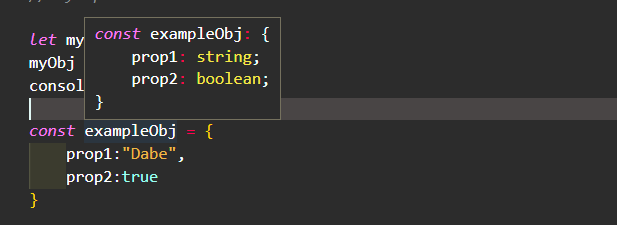
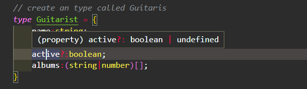
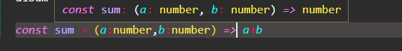
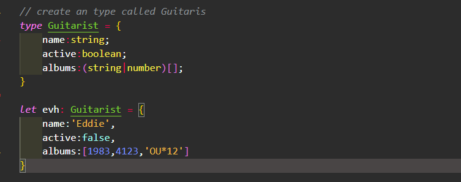
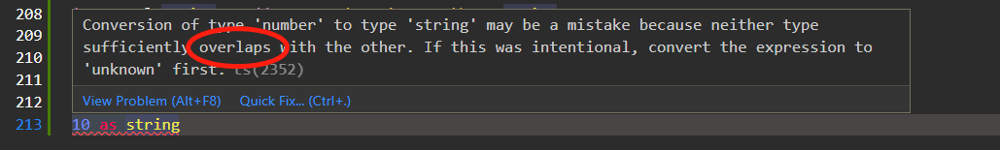

### 补充
- defer defer 特性告诉浏览器不要等待脚本。相反，浏览器将继续处理 HTML，构建 DOM。脚本会“在后台”下载，然后等 DOM 构建完成后，脚本才会执行。换句话说：具有 defer 特性的脚本不会阻塞页面。具有 defer 特性的脚本总是要等到 DOM 解析完毕，但在 DOMContentLoaded 事件之前执行。
- async async 特性与 defer 有些类似。它也能够让脚本不阻塞页面。但是，在行为上二者有着重要的区别。async 特性意味着脚本是完全独立的：DOMContentLoaded 和异步脚本不会彼此等待.
### tsconfig.json文件
```
compilerOptions对象中的一些属性
1. rootDir 
2. outDir
3. "target": "ES2016", 设置编译后的JS版本,

在compilerOptions的同级，设置 include
"include": [
    "src/**/*"
  ],
确保只编译src文件夹下面的内容

如果类型检查出现错误，就不会生成编译后的文件
"noEmitOnError": true, /* Disable emitting files if any type checking errors are reported. */
```

### TS = strongly Typed Lang
- TS is static typing: types are checked at compile time.
- JS is dynamic typing: types are checked at run time.

### TS concept
- implicit typing 隐式类型，TS自动进行类型推断
```TS
// 变量名 myname没有明确的被指明类型，但TS编译器能够准确的推断出myname的类型为string
let myname = "Dave"
```
- explicit typing:显示声明类型
- Basic types
```TS
// string
let yourname:string = 'bob'
let age:number = 12
let isLoading:boolean = false;
let re:RegExp = /\w+/g
// union types 类型的结合运算 = 求并集
let album:string|number;
album = '12312312'
album = 123123
// tuple & union type arr
// Tuple is  spcial postition with spicial type
// myTumple表示共三个元素，类型依次是string,number,boolean
let myTuple:[string,number,boolean] = ['dave',123,false];
// union types
// mixed表示，这个数组中的元素的类型可以是：string,number,boolean
let mixed = ['jhone',1,false]

// object
const exampleObj = {
    prop1:"Dabe",
    prop2:true
}

// type 用来创建一个类型
// create an type called Guitaris
type Guitarist = {
    name:string;
    // make it optional, => active:undefined|boolean
    active?:boolean;
    albums:(string|number)[];
}

let evh: Guitarist = {
    name:'Eddie',
    active:false,
    albums:[1983,4123,'OU*12']
}

const greetGuitaris = (guitaris: Guitarist) => {
  return `Hello ${guitaris}!`
}


const isActive = (guitarist:Guitaris) => {
  // type narrow
  if (guitarist.active !== undefined) {
    return guitarist.active
  }
  return false
}

// interface
interface Guitaris {
    name:string;
    active?:boolean;
    albums:(number|string)[]
}


// Eums: something added to the lang and runtime
enum Grade {
    U = 1,
    D,
    C,
    B,
    A
}
console.log(Grade.A)

// type alias
type stringOrNumber = string | number
type stringOrNumberArray = (string | number)[]
type Guitaris2 = {
    name?:string;
    active:boolean;
    albums:stringOrNumberArray;
}
type UserId = stringOrNumber;

// Literal types
let davename:'Dave' = 'Dave'
let userName:'Dave'|'Jhone'|'Amy';
userName = 'Dave'

// create a func type
// create a func signature
type mathFunc = (a:number,b:number) => number
const mutiply:mathFunc = (a,b) => a*b;
// 使用接口定义函数
interface ImathFunc {
    (a:number,b:number):number;
}
const divide:ImathFunc = (a,b) => a/b;
// func: default value, reset params, optional value
// 其实没有传值，JS会自动给你传入undefined;

// never

// type assertion or type casting
type One = string
type Two = string | number
type Three = 'hello'
// convert to more or less specific
let somea:One = 'hello'
let b = a as Two
let somec = somea as Three;

let d = <One> 'world'
let e = <string|number> 'word'

const addOrConcat =  (a:number,b:number, c:'add' | 'concat'):number|string => {
    if(c === 'add') {
        return a + b;
    } else {
        return '' + a + b + c;
    }
}
let myval:string = addOrConcat(1,2,'concat') as string
// Be careful! TS sees no problem here - but a string is returned;
let nextval:number = addOrConcat(1,23,'concat') as number

// unkonw 
// 10 as string

// the DOM
// 原来感叹号是非null和非undefined的类型断言
const img = document.querySelector('.img')!
const myimg = document.querySelector('#img') as HTMLImageElement
// will not work in JSX file.
const nextImg  = <HTMLImageElement>document.getElementById('#img');
(img as HTMLImageElement).src = 'http://baiduc.com'
```





### references
- https://www.youtube.com/watch?v=gieEQFIfgYc